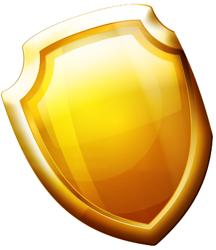

# Factions

"_At the beginning there was a blank file. And after the last unit test, the Bot was born and it was the same as its programmer."_ - Jonas, the Senior profet.

There are 6 types of Bots in the universe of Giveaway Bots. Each with its own capabilities and weaknesses.

|                                                       |                                                                                |
| :---------------------------------------------------: | :----------------------------------------------------------------------------: |
|                       |                                                |
|     **Rust **The common Bot. Strength in numbers.     |                      **Iron **Zero wrinkles clothed code.                      |
|                 |                                               |
| **Aquamarine **Code living by the old navy tradition. |         **Stark **Code made by a philantropist, playboy, millionaire.          |
|                       |                                          |
|          **Gold **The bling of codes. Shiny!          | **Watermelon **The cream of the crop. The most organized and tidy code around. |

