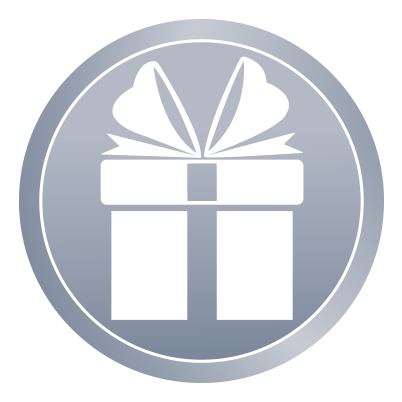

# Tokenomics

## **Game currency - GIFT Token**

Giveaway Bots token is GIFT. There will be a fixed amount of 250 million GIFT tokens. 

## GIFT utility

**Acquire game assets: **GIFTs could be used for purchasing Game packs.

**Play-to-Earn: **Each game mode rewards GIFTs.

### Token Allocation

| Distribution               |   Amount   | Proportion |
| -------------------------- | :--------: | :--------: |
| Team and investors         |  50'000000 |     20%    |
| Presale & ICO              |  50'000000 |     20%    |
| Airdrops                   |  5'000000  |     2%     |
| Community & Marketing      |  20'000000 |     8%     |
| Player rewards & Ecosystem | 125'000000 |     50%    |

###

### Team and investors

The team and investors tokens will be released starting on the first day of April 2022. The releases will be twice a month over a period of 6 months.

###

### Presale & ICO

There are 2 ways to obtain GIFT Tokens: Presale & ICO. Presale will be exclusive for early adopters of Giveaway Bots NFTs. The ICO will then be public. Price and restrictions will be announced via our social media.

###

### Airdrops

**Airdrop 1:** As a way of thanking RAWR! hardcore collectors, we will make a snapshot of your rawrtrading1 collections and do an airdrop of GIFT tokens among those who fulfill requirements. Those requirements will be disclosed after the airdrop.

**Airdrop 2:** We will do a second airdrop on Q4 2023 between all early adopters of Giveaway Bots NFTs. Snapshot will be taken in a secret date on Q4 2021.

###

### Community & Marketing

In order to be focused 100% on the game, we will delegate all our GB social media to third parties.

###

### Player rewards & Ecosystem

We will provide rewards for both modes: Mining and game. And game development costs: Servers, dev and maintainance.

### The GIFT cycle

In order to assure balance on the token market cost, we will provide 2 burn mechanisms for the token:

**Manual burn:** We will burn all unused tokens from the game cycle every 2 weeks.

**Packs sale:** All packs price will be marked on GIFT. The contents of these packs will be of utility inside the game. We will disclose said content in the future.
